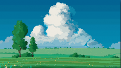

# Maze Hunters

A Python maze game built with Pygame where players navigate through levels, avoid enemies, and collect treasures.

## Features

- **Multiple Levels**: Currently 5 challenging levels with plans to add more
- **Enemy AI**: Enemies that patrol vertically or horizontally
- **Collision System**: Walls block movement, enemies trigger level reset
- **Progressive Difficulty**: Each level introduces more enemies and complexity
- **Win Condition**: Collect the treasure to advance to the next level
- **Full Game Loop**: Game restarts after completing all levels

## Installation

## Controls
- W: Move Up
- A: Move Left
- S: Move Down
- D: Move Right

## Game Mechanics
- Player must reach the blue diamond treasure to complete each level
- Colliding with walls or enemies resets the current level
- Game automatically progresses to the next level upon success
- After completing all levels, the game restarts from level 1

## Future Plans
- Add scoring system
- Implement main menu and pause screen
- Add more enemy types with different behaviors
- Create additional levels with varied designs
- Implement power-ups and special abilities

## Assets Attribution
All game assets used in this project were sourced from OpenGameArt.org and other free asset repositories. Full attribution will be provided here.
- Spring The Pensive Badger & Friends, 2nd Edition by Spring Spring ([link](https://opengameart.org/content/spring-the-pensive-badger-friends-2nd-edition)) 
- Slimy Snail by Chupup Games ([link](https://opengameart.org/content/slimy-snail))
- Dark Character (Animated) by MEDROV ([link](https://opengameart.org/content/dark-character-animated))
- cultist by primbal ([link](https://opengameart.org/content/cultist))
- diamond by Flixberry Entertainment ([link](https://opengameart.org/content/diamond))
- 2D wall tilesets by Nemo666 ([link](https://opengameart.org/content/2d-wall-tilesets))
- 2D Spider by ethanf30games ([link](https://opengameart.org/content/2d-spider))
- Simple Natural landscape Pixel Art Background by CraftPix.net 2D Game Assets ([link](https://opengameart.org/content/simple-natural-landscape-pixel-art-background))
- Baby dragon sprites by Alekei ([link](https://opengameart.org/content/baby-dragon-sprites))
- Pixel Character by bellow ([link](https://opengameart.org/content/pixel-character-0))

## Contributing
This is currently a personal educational project. Contributions are not being accepted at this time.

## License
This project is licensed under the MIT License - see the LICENSE file for details.
***
Note: This project was developed as part of a mentorship program and serves as a demonstration of Python development skills.